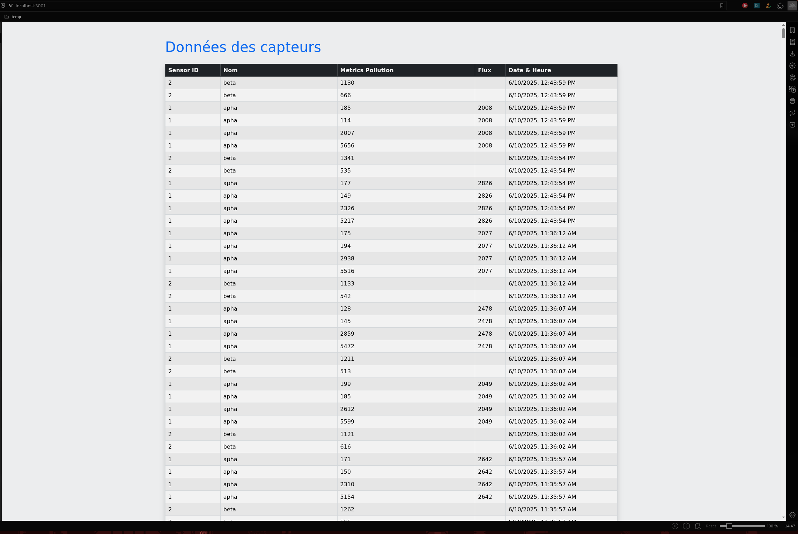

# CESI A4 Web Avancé Prosit 4

## Description

Ce projet simule un système de capteurs connectés avec une architecture microservices :
- **sensor** : simule des capteurs qui envoient périodiquement des données.
- **backend** : API Node.js/Express qui stocke les données dans MongoDB.
- **frontend** : interface web pour visualiser les données en temps réel.

### Aperçu de l’interface frontend



## Démarrage rapide

### Prérequis

- [Docker](https://www.docker.com/)
- [Docker Compose](https://docs.docker.com/compose/)

### Lancer le projet

```bash
docker-compose up --build
```

- Le backend (API) sera disponible sur `localhost:3000`
- Le frontend (interface web) sera disponible sur `localhost:3001`

### Arrêter le projet

```bash
docker-compose down
```

## Structure des dossiers

- `sensor/` : code des capteurs simulés
- `backend/` : serveur API Node.js/Express + MongoDB
- `frontend/` : serveur web pour la visualisation

## Variables d'environnement

- `backend` : `MONGO_URI` (voir `docker-compose.yml`)
- `sensor` : `SENSOR_ID`, `SERVER_URL` (voir `docker-compose.yml`)
